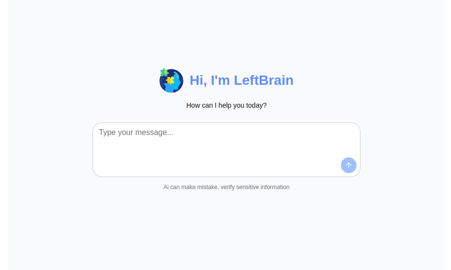
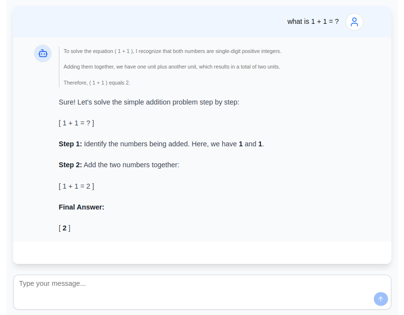
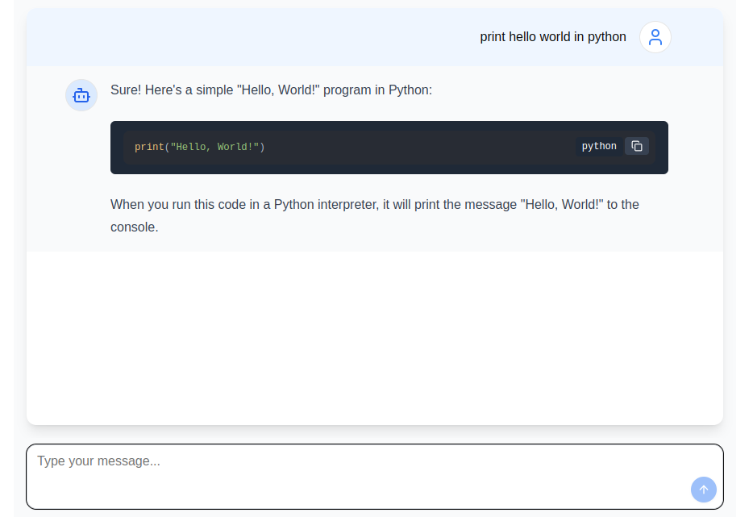

# Left Brain AI Assistant 🧠

Left Brain AI is an AI-powered assistant built with **[Bun.js](https://bun.sh/)** and **[Next.js](https://nextjs.org/)**, using **[Ollama](https://ollama.com/)** to run the **DeepSeek AI** model locally. It is optimized for speed, efficiency, and privacy by processing everything on your machine.

## 🚀 Features

-   ⚡ **Fast & Lightweight** – Powered by Bun.js for quick performance
-   🤖 **AI-Powered Responses** – Uses DeepSeek AI for intelligent reasoning
-   🌐 **Local Processing** – Ensures privacy by running on your machine
-   🎨 **Modern UI** – Built with Next.js and styled for a smooth user experience

---

## 📌 Prerequisites

Before running the project, ensure you have the following installed:

-   **[Bun.js](https://bun.sh/)** – A fast JavaScript runtime
-   **[Ollama](https://ollama.com/)** – To run the DeepSeek model locally
-   **DeepSeek Model** – Download and install the model using:

    -   [DeepSeek Model Library](https://ollama.com/library/deepseek-r1) (choose the model you prefer)
    -   [LLM Memory Calculator](https://llm-calc.rayfernando.ai/?quant=fp16) (to check RAM requirements)

```bash
ollama pull deepseek-r1:1.5b # this is the lowest and lighter model, you can pull any higher and effiecient model if you prefer according, then ollama pull <model_name>.
```

## Getting Started

First, make sure Ollama is running and serving the model over `localhost:11434`:

```bash
ollama run deepseek-r1:1.5b
```

then, clone the repository:

```bash
git clone https://github.com/Sharif-Minhaz/left-brain-ai-assistance.git
```

Install dependencies:

```bash
cd left-brain-ai-assistance
bun install
```

Run the development server:

```bash
bun dev
```

Open [http://localhost:3000](http://localhost:3000) with your browser to see the result.

For further improvement and customization, you can start editing the pages by modifying `src/app/page.tsx`, `src/lib/actions/ollama`, `src/components/chat`. The page auto-updates as you edit the file.

📸 Screenshots
Here are some previews of the project:

##### 🏠 Home Page (Full Width)



##### 💬 Chat Interface & AI Responses

<div align="center">
  
  
</div>

## Configuration

To modify the application configuration, update the following variables in `/app/src/config`:

```ts
export const OLLAMA_BASE_URL = "http://localhost:11434";
export const OLLAMA_MODEL = "deepseek-r1:1.5b";
```

## Deployment

To build the project for production, run:

```bash
bun run build
```

Then, start the server:

```bash
bun start
```

## License

This project is open-source under the [MIT License](LICENSE).
